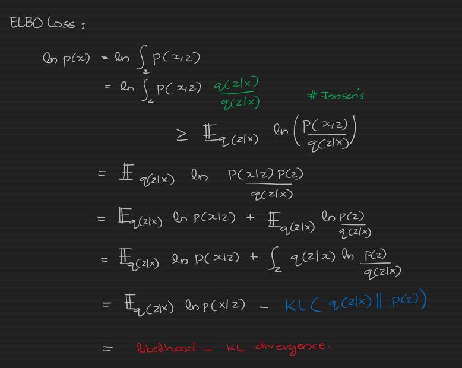

# VAE for Relational Record Generation
*VAE for Relational Data Generation*


### Pre-processing
```sql
Continous Attributes : GMM based on number of modes
Discrete Attributes : 1-hot encoded
```
#### Loss Function:
###### Evidence Based Lower Bound


<div style='page-break-after: always'></div>


#### Project Structure:

```
|   LICENSE
|   README.md
|   requirements.txt
|   run.py
|
+---datasets
|       taxi.csv
|
+---examples
|       gen_taxi_dataset.py
|
+---models
|   |   base.py
|   |
|   +---vae
|   |   |   Decoder.py
|   |   |   Encoder.py
|   |   |   VAE.py
|   |   |
|   |   \---__pycache__
|   |           Decoder.cpython-37.pyc
|   |           Encoder.cpython-37.pyc
|   |           VAE.cpython-37.pyc
|   |
|   \---__pycache__
|           base.cpython-37.pyc
|
+---utils
|   |   conditional_sampler.py
|   |   file_utils.py
|   |   transformer.py
|   |   _transformer.py
|   |
|   \---__pycache__
|           file_utils.cpython-37.pyc
|           transformer.cpython-37.pyc
|
\---weights
        vae.pt
        w.pt
        w2.pt
 ```

